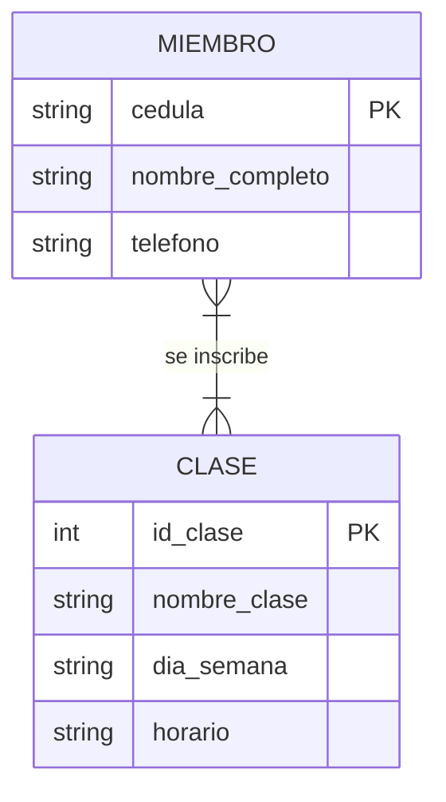

# Unidad III: Conceptos de Base de Datos - Caso de Estudio "FitLife"

## 1. Identificación de Entidades y Atributos (Claves Primarias)

En base al análisis del negocio, se han identificado las siguientes entidades:

### Entidad: Miembro
*   **cedula (PK):** Texto (Identificador único).
*   **nombre_completo:** Texto.
*   **telefono:** Texto.

### Entidad: Clase
*   **id_clase (PK):** Entero (Autoincremental).
*   **nombre_clase:** Texto.
*   **dia_semana:** Texto.
*   **horario:** Texto.

---

## 2. Identificación de la Relación y Cardinalidad

*   **Relación:** Un miembro puede inscribirse en múltiples clases y cada clase puede tener múltiples miembros.
*   **Cardinalidad:** Muchos a Muchos (N:M).

---

## 3. Diagrama Entidad-Relación (ER)

El diagrama inicial plantea la relación directa entre el Miembro y la Clase:

---

## 4. Modelo Relacional (Normalizado)

Para resolver la relación N:M, se crea la tabla intermedia **Inscripciones**. Esto transforma la relación en dos relaciones 1:N.

### Estructura de la Tabla Intermedia:
*   **id_inscripcion (PK):** Identificador único de la inscripción.
*   **cedula_miembro (FK):** Referencia a la tabla Miembros.
*   **id_clase (FK):** Referencia a la tabla Clases.

---

## 5. Implementación en SQLite

Se han creado los scripts necesarios para la creación de la estructura e inserción de datos iniciales. Puede consultarlos en el archivo `consulta.sql`.
